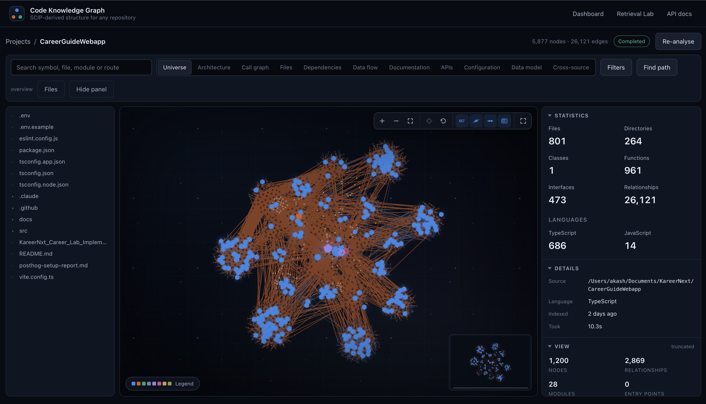
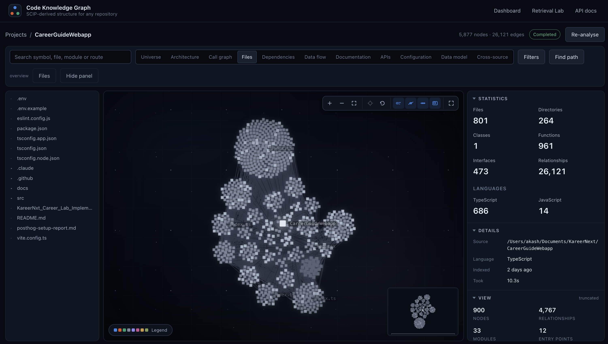
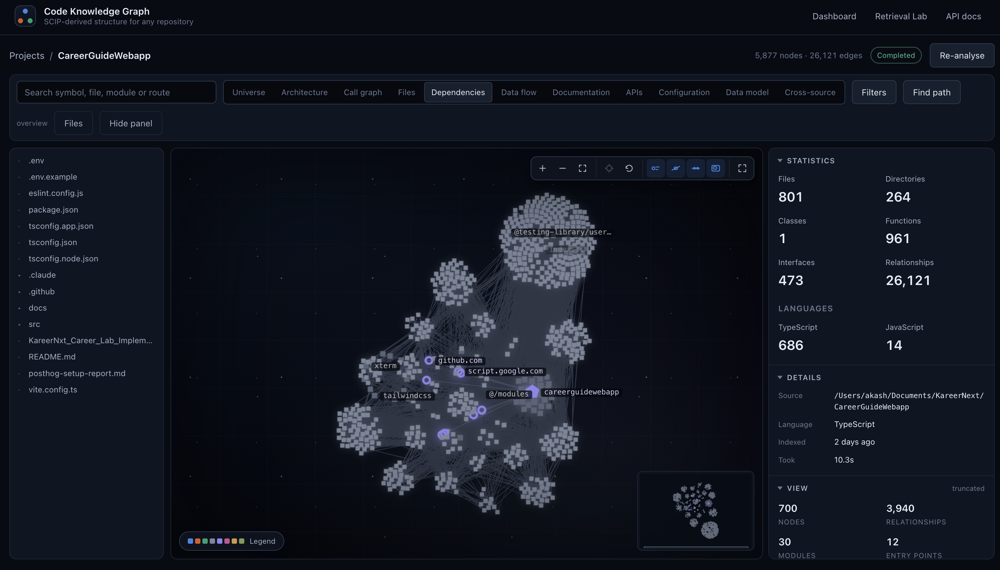
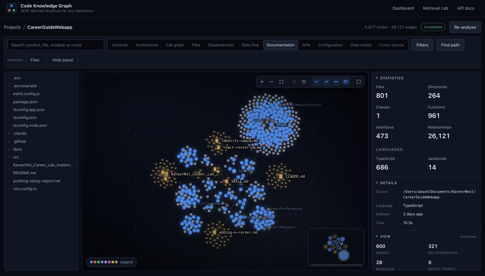
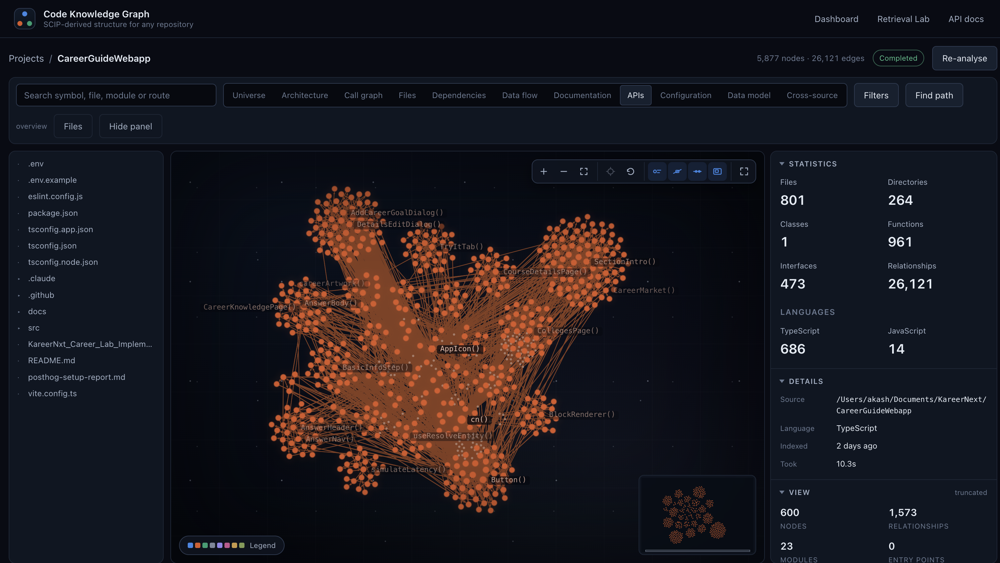

# Code Knowledge Graph

**Turn any repository into a queryable, evidence-backed graph of everything in
it — its code, and the documentation, configuration, contracts and schema around
the code.**




---

## Contents

- [Overview](#overview)
- [Highlights](#highlights)
- [Screenshots](#screenshots)
- [Getting started](#getting-started) — install, connect your AI agent over MCP, verify
- [How it works](#how-it-works)
- [Retrieval evaluation report](#retrieval-evaluation-report)
- [MCP server](#mcp-server)
- [Using the web UI](#using-the-web-ui)
- [Setup in detail](#setup-in-detail)
- [Configuration](#configuration)
- [Repository layout](#repository-layout)
- [Development](#development)
- [Scope](#scope)
- [Documentation](#documentation)

---

## Overview

Code Knowledge Graph indexes a repository with
[SCIP](https://github.com/sourcegraph/scip) for its compiler-level facts, reads
it again with source analyzers for the facts no compiler has an opinion about,
and normalises the result into one language-neutral graph:

- **Code** — classes, interfaces, functions, methods and files, joined by
  `CALLS`, `REFERENCES`, `IMPLEMENTS`, `EXTENDS`, `IMPORTS`, `EXPORTS`,
  `INSTANTIATES`, `ACCEPTS`, `RETURNS` and `CONTAINS`.
- **Architecture** — API routes, the service itself, databases, tables, queues,
  events, external services and configuration, joined by `ROUTES_TO`, `USES`,
  `READS_FROM`, `WRITES_TO`, `PUBLISHES`, `SUBSCRIBES`, `CONFIGURED_BY`,
  `AUTHENTICATED_BY`, `VALIDATES`, `DEPENDS_ON` and `DEPENDS_ON_SERVICE`.
- **Repository knowledge** — Markdown documents and sections, JSON/YAML
  configuration, OpenAPI specifications and endpoints, SQL migrations, tables
  and columns, with cross-source relationships (`DOCUMENTS`, `IMPLEMENTED_BY`,
  `DEFINES`, …) that join a contract to its handler and prose to its subject.

The graph is stored in PostgreSQL, served through a traversal-first HTTP API,
rendered in the browser with WebGL (Sigma.js + Graphology), and exposed to AI
agents through an **MCP server**.

**Every edge records what observed it and how much that observer trusts it.**
An analyzer that cannot resolve a reference emits nothing rather than a guess: a
graph you have to second-guess is worse than a smaller one you can trust.

The graph is the product. SCIP is one way to populate it, PostgreSQL is one way
to store it, and the API is one way to read it — each is replaceable without
touching the others.

> **Status: working foundation.** The pipeline runs end to end for TypeScript and
> JavaScript, including the architectural and repository-knowledge layers, the
> web UI and the MCP server. Other languages, embeddings/vector search and LLM
> integration are deliberately not implemented yet — see [Scope](#scope).

---

## Highlights

| | |
| --- | --- |
| **Deterministic** | SCIP is the source of truth for code relationships. Same input, same graph — byte for byte. |
| **Evidence on every edge** | Each relationship carries the analyzer that produced it, a confidence, and the file and line it was observed at. |
| **Beyond code** | Markdown, JSON, YAML, OpenAPI and SQL are first-class sources, linked to the code they describe. |
| **Architecture view** | Routes → controllers → services → repositories → tables, queues, events and third-party services, recovered from source. |
| **Eleven views, one graph** | Universe, Architecture, Call graph, Files, Dependencies, Data flow, Documentation, APIs, Configuration, Data model, Cross-source. |
| **Agent-ready** | Seven MCP tools let a coding agent search, inspect, trace and read the indexed repository. |
| **Measured** | A precision/recall benchmark for the graph, and a retrieval evaluation (49/49) for what the API can actually answer. |
| **Scales to real projects** | A 801-file production app indexes in ~10 s into 5,877 nodes and 26,121 edges. |

---

## Screenshots

All five screenshots are the same real-world project — a React + TypeScript web
app of **801 files, 264 directories, 961 functions and 473 interfaces**, indexed
in **10.3 s** into **5,877 nodes and 26,121 edges**. Each tab is the same graph
under a different *projection*; nothing is re-indexed when you switch.

Every screen shares the same layout: the project's file tree on the left, the
WebGL canvas in the middle (zoom, fit, focus, re-layout and full-screen controls
top right; a minimap bottom right; a legend bottom left), and on the right the
**Statistics** the pipeline counted, run **Details**, and a **View** panel
showing how much of the graph the current projection is drawing.

### Universe — the whole repository at once


Every node and relationship type together. Nodes are laid out as a galaxy:
clustered by source directory, placed by a force simulation, and sized and lit
by importance (degree, centrality, node type, entry-point and exported status).
The blue clusters are modules of symbols; the dense orange mesh is the call and
reference traffic between them. The View panel shows the canvas holding
1,200 nodes / 2,869 relationships across 28 modules — the view is *truncated*
on purpose so a very large graph stays interactive, and zoom is semantic: far
out you see structure, close in you see symbols.

### Files — the physical structure



Only files and directories, joined by containment. Each flower-shaped cluster is
a directory and each square a file, radiating from the repository root
(`CareerGuideWebapp`, centre). Barrel files such as `index.ts` are labelled as
cluster hubs. Useful for seeing how a codebase is physically organised — which
directories are large, which are deep, and where the entry points (12 here) sit.

### Dependencies — what the project leans on



The same file structure, overlaid with the **external dependencies** the code
imports or calls: npm packages (`tailwindcss`, `xterm`,
`@testing-library/user-event`), path aliases (`@/modules`), and external hosts
the source talks to (`github.com`, `script.google.com`), drawn as purple rings.
The pentagon is the service node for the project itself (`careerguidewebapp`).
This is the view for answering *"what would break if we dropped this package?"*
or *"which third-party services does this app reach out to?"*

### Documentation — prose linked to code



Markdown documents (yellow — `CLAUDE.md`, `SKILL.md`, `adding-a-career.md`,
`react-router-v6.md`, …) each surrounded by their own sections, next to the
code symbols (blue — `CareerPreferences`, `ProjectRequest`, `ApiError`, …)
those documents mention. The thin lines between them are `DOCUMENTS`
relationships produced by the repository-knowledge layer: the graph knows which
page of prose is about which type, so an agent asking *"is there documentation
for this?"* gets an answer with evidence rather than a guess.

### APIs — the callable surface



Functions and components and the calls between them — `AppIcon()`,
`Button()`, `CoursesPage()`, `useResolveEntity()`, `cn()` and so on. Heavily
connected utilities (`cn()`, `Button()`) sit at the centre of the mesh, while
page-level components form their own clusters at the edges. For a backend
service the same tab surfaces HTTP routes and the handlers they route to.

> The screenshots show the **Universe, Files, Dependencies, Documentation and
> APIs** views. **Architecture, Call graph, Data flow, Configuration, Data model
> and Cross-source** are the same graph under other projections — the bundled
> `express-postgres-sample` is the best way to see Architecture and Data flow.

---

## Getting started

This takes about five minutes. By the end you will have the graph running
locally, your AI coding agent connected to it over MCP, and the repository you
work in indexed automatically.

```
Your agent (Claude Code, Cursor, VS Code, …)
   │  launches, over stdio
   ▼
MCP server ──HTTP──▶ API ──▶ PostgreSQL ◀── worker (indexes your repos)
                      ▲
            web UI ───┘  http://localhost:5173
```

You run the **API, worker and PostgreSQL** once, in a terminal. Your agent
starts the **MCP server** by itself whenever it needs it, so you never run
that by hand.

### 1. Prerequisites

| Tool | Version | Check |
| --- | --- | --- |
| Node.js | 20.11 or newer | `node --version` |
| pnpm | 9 or newer | `pnpm --version` (install: `corepack enable`) |
| Docker | Any recent version | `docker info` (it must be running) |
| Git | Any | `git --version` |

Docker is only used for PostgreSQL. If you already run PostgreSQL, you can
skip Docker and point `DATABASE_URL` at your own server.

At present only **TypeScript and JavaScript** repositories get full code
analysis. Markdown, JSON/YAML, OpenAPI and SQL files are read in any
repository.

### 2. Clone, install, configure

```bash
git clone https://github.com/BotAi-Solutions/code-graph.git
cd code-graph
pnpm install
cp .env.example .env
pnpm setup:scip        # should print: ok  typescript  …/scip-typescript
```

The defaults in `.env` work as they are. Only change them if a port is already
taken:

- **3000 in use:** set `PORT=3001`. The web UI and the MCP server both follow it.
- **5432 in use** (for example by a local PostgreSQL): set `POSTGRES_PORT=5433`
  and change the port in `DATABASE_URL` to match.

### 3. Start the backend

```bash
pnpm dev:all            # PostgreSQL + build + migrations + API + worker + web UI
pnpm dev:all --no-web   # the same, without the web UI
```

Wait until it prints **`CodeRAG is running`**. Leave this terminal open: the
MCP tools only work while the API and the worker are running. Press Ctrl+C to
stop them. PostgreSQL keeps running, and so does your data;
`docker compose stop postgres` stops it.

`dev:all` also builds `apps/mcp/dist/server.js`, which is the file every MCP
client below points to.

### 4. Connect your AI agent

Find the absolute path of the MCP server once. Every configuration below needs
it:

```bash
echo "$(pwd)/apps/mcp/dist/server.js"
# e.g. /Users/you/code/code-graph/apps/mcp/dist/server.js
```

Below, replace `/ABS/PATH/code-graph` with the folder that command printed,
minus the `/apps/mcp/dist/server.js` part.

The MCP server has to know **which repository to index**:

- **Claude Code** tells it automatically, through the `CLAUDE_PROJECT_DIR`
  variable, for whatever repository you open.
- **Every other client** needs `CODERAG_PROJECT_DIR` set in its server
  configuration. Without it, pass `rootPath` to `ensure_project` or
  `index_project` when you call them.

No API keys and no database credentials go in any of these files. The server
reads the `.env` from its own checkout, so it finds the API wherever you launch
it from.

<details open>
<summary><b>Claude Code</b> (CLI and the VS Code / JetBrains extensions)</summary>

Register it once, at user scope, and it works in every repository you open:

```bash
claude mcp add --scope user code-graph -- node /ABS/PATH/code-graph/apps/mcp/dist/server.js
```

Check it:

```bash
claude mcp get code-graph     # should show: Status: ✓ Connected
```

Then open Claude Code in any repository and run `/mcp`. It should list
`code-graph` with nine tools. When a session starts, the server registers the
open repository and queues indexing if it is new or has changed, so you don't
have to do anything else.

To enable it for a single repository only, commit this as `.mcp.json` at that
repository's root instead:

```json
{
  "mcpServers": {
    "code-graph": {
      "command": "node",
      "args": ["/ABS/PATH/code-graph/apps/mcp/dist/server.js"]
    }
  }
}
```

</details>

<details>
<summary><b>Cursor</b></summary>

Add this to `~/.cursor/mcp.json` (all projects) or to `.cursor/mcp.json` in one
project:

```json
{
  "mcpServers": {
    "code-graph": {
      "command": "node",
      "args": ["/ABS/PATH/code-graph/apps/mcp/dist/server.js"],
      "env": { "CODERAG_PROJECT_DIR": "${workspaceFolder}" }
    }
  }
}
```

If your Cursor version doesn't expand `${workspaceFolder}`, put the
repository's absolute path there, or put the file in the project's
`.cursor/mcp.json` with that project's path. Then enable **code-graph** under
**Settings → MCP**.

</details>

<details>
<summary><b>VS Code</b> (GitHub Copilot agent mode)</summary>

Create `.vscode/mcp.json` in the repository you want analysed. VS Code uses
`servers`, not `mcpServers`:

```json
{
  "servers": {
    "code-graph": {
      "type": "stdio",
      "command": "node",
      "args": ["/ABS/PATH/code-graph/apps/mcp/dist/server.js"],
      "env": { "CODERAG_PROJECT_DIR": "${workspaceFolder}" }
    }
  }
}
```

Click **Start** above the server entry, then choose **Agent** mode in the chat
view. The tools appear under the tools icon.

</details>

<details>
<summary><b>Claude Desktop</b></summary>

Edit `claude_desktop_config.json`:

- macOS: `~/Library/Application Support/Claude/claude_desktop_config.json`
- Windows: `%APPDATA%\Claude\claude_desktop_config.json`

```json
{
  "mcpServers": {
    "code-graph": {
      "command": "node",
      "args": ["/ABS/PATH/code-graph/apps/mcp/dist/server.js"],
      "env": { "CODERAG_PROJECT_DIR": "/ABS/PATH/to/the/repo/you/want/analysed" }
    }
  }
}
```

Claude Desktop has no notion of an open project, so either fix one repository
here or leave `env` out and name the folder in chat ("index
/Users/me/code/my-app"). Restart Claude Desktop after editing the file.

</details>

<details>
<summary><b>Any other MCP client</b> (Windsurf, Codex, Zed, …)</summary>

Every stdio-capable client needs the same three things:

| Setting | Value |
| --- | --- |
| Command | `node` |
| Arguments | `/ABS/PATH/code-graph/apps/mcp/dist/server.js` |
| Environment | `CODERAG_PROJECT_DIR=<absolute path of the repository>` (optional, but without it you pass `rootPath` yourself) |

Put these in whatever configuration format your client uses.

</details>

### 5. Verify it works

In your agent, open the repository you want analysed and ask:

1. **"Call ensure_project."** A new repository comes back `registered` with
   an indexing run id. One already indexed comes back `ready`.
2. **"Check get_index_status until it's ready."** Small repositories finish in
   seconds. Large ones can take a few minutes.
3. **"Use search_graph to find the main entry point."** You should get
   symbols from your code, with file paths and line numbers.

You can watch the same graph at **<http://localhost:5173>**: click **Select
project** and pick the repository.

### 6. Everyday use

Once it's connected, just ask questions. The agent chooses the tools. Some
prompts that work well:

- *"Who calls `createOrder`, and what does it end up writing to the database?"*
- *"Trace the path from the `POST /api/orders` route to the `orders` table."*
- *"Which files implement what `docs/billing.md` describes?"*
- *"What would break if I changed the signature of `UserService.update`?"*
- *"Where is `STRIPE_SECRET` read, and which services depend on it?"*

The graph keeps up with your edits. When files change after the last index, the
status is reported as `stale`, and the next session start (or `ensure_project`)
re-indexes. To force a rebuild, ask: *"index_project with force: true"*.

Each day, the only step is to start the backend (`pnpm dev:all --no-web`)
before you open your agent.

### 7. Updating

```bash
git pull
pnpm install
pnpm dev:all     # rebuilds, applies new migrations and restarts everything
```

Restart your agent session afterwards so it starts the new MCP server build.

### 8. If something goes wrong

| Symptom | Fix |
| --- | --- |
| `/mcp` shows code-graph as failed; `Cannot find module …/dist/server.js` | Not built yet: run `pnpm dev:all` (or `pnpm build:packages`) |
| Every tool says the API *could not be reached* | The backend isn't running: `pnpm dev:all`. If you changed `PORT`, it's picked up automatically |
| Indexing stays `QUEUED` | The worker isn't running: use `pnpm dev:all`, not `pnpm dev:api` |
| `dev:all` says *Is Docker running?* | Start Docker Desktop, or point `DATABASE_URL` at your own PostgreSQL |
| `dev:all` says *port … is already in use* | Another copy is running. Stop it, or change `PORT` / `POSTGRES_PORT` in `.env` |
| `PROJECT_ROOT_UNDETERMINED` | Your client didn't say which repository is open: set `CODERAG_PROJECT_DIR`, or pass `rootPath` |
| `PROJECT_ROOT_NOT_A_PROJECT` | The folder has no `.git` or manifest: open the repository root instead |
| `search_graph` doesn't find code you just wrote | The graph is stale: re-run `ensure_project`, or use `search_code` for literal text |

For more (every tool's parameters, what *stale* means exactly, how project
registration works), see [docs/mcp.md](docs/mcp.md).

### Using only the web UI

If you don't use an AI agent:

```bash
pnpm dev:all
```

Then open **<http://localhost:5173>**, click **Select project**, and choose a
repository folder. After the first run, `pnpm dev` is enough as long as
PostgreSQL is still up.

### Commands

| Command | What it does |
| --- | --- |
| `pnpm dev` | API, worker and web together, in watch mode |
| `pnpm dev:all` | Everything an MCP client needs: PostgreSQL (if not already up), build, migrations, API, worker and web (`--no-web` to skip it) |
| `pnpm dev:api` | Just the API (OpenAPI UI at `/docs`) |
| `pnpm dev:worker` | Just the indexing worker |
| `pnpm dev:web` | Just the web app |
| `pnpm dev:mcp` | Just the MCP server (an MCP client normally launches it) |
| `pnpm analyze:sample [path]` | Run the full pipeline on a sample and print the result, no browser |
| `pnpm test` | The whole test suite (Vitest) |
| `pnpm typecheck` | Type-check everything |
| `pnpm build` | Type-check, emit packages, build the web app |
| `pnpm benchmark` | Score the graph against the hand-written ground truth |
| `pnpm evaluate:retrieval` | Score the retrieval API against 49 real code questions |
| `pnpm setup:scip` | Verify the SCIP indexer is installed |
| `pnpm fixtures:build` | Regenerate the `index.scip` test fixtures |
| `pnpm db:migrate` / `pnpm db:status` | Apply / list database migrations |
| `docker compose down` | Stop PostgreSQL, keep the data |
| `docker compose down -v` | Stop PostgreSQL and throw the data away |

---

## How it works

```
Local folder  (native picker)   apps/api/src/modules/filesystem
        │
        ▼
Git / local repository
        │
        ▼
 Repository analyzer        apps/worker
        │
        ▼
 Project scanner            packages/language-detection
 Language detection         ──▶  code · document · configuration ·
 File classification             schema · database · generated · …
        │
        ▼
 SCIP indexer               packages/scip  ──▶  index.scip
        │
        ▼
 SCIP parser                packages/scip/src/parser
        │
        ▼
 Graph builder              packages/graph      ──▶  symbols, calls, references
        │
        ▼
 Source analyzers           packages/analysis   ──▶  APIs, tables, columns,
        │                                            containers, config, queues,
        │                                            events, integrations
        ▼
 Classification analyzers   packages/analysis   ──▶  API specifications,
        │                                            documents, class roles,
        │                                            cross-source relationships
        ▼
 Graph assembler            packages/graph      ──▶  one graph, merged by
        │                                            identity, every edge evidenced
        ▼
 Repository knowledge graph
        │
        ├──▶ PostgreSQL             packages/database
        │         │
        │         ▼
        │    Graph API              apps/api   ──▶  MCP server  apps/mcp
        │         │
        │         ▼
        │    React web UI           apps/web
        │
        ├──▶ Benchmark              packages/benchmark       ──▶ precision, recall,
        │                                                        evidence, paths
        └──▶ Retrieval evaluation   packages/retrieval-eval  ──▶ can the API answer
                                                                 real questions?
```

For the bundled Express sample, the Architecture view recovers exactly the
service's shape:

```
POST /users ──ROUTES_TO──▶ UserController ──CALLS──▶ UserService ──CALLS──▶ UserRepository ──WRITES_TO──▶ users
                                                          │
                                                     CALLS│──▶ SendGrid · Stripe
                                                 PUBLISHES│──▶ welcome-emails · user.created
```

Read [docs/architecture.md](docs/architecture.md) for what each stage owns and
why the boundaries fall where they do, and
[docs/repository-knowledge.md](docs/repository-knowledge.md) for the layer that
reads the non-code half.

---

## Retrieval evaluation report

A graph is only useful if the right facts can be *retrieved* from it. The
retrieval evaluation (`packages/retrieval-eval`) asks 49 real code questions of
the **public HTTP API** — the same endpoints the MCP tools wrap — and checks the
evidence that comes back against a hand-written expectation, by identity. No
LLM, no fuzzy scoring: every verdict is `PASS`, `PARTIAL` or `FAIL` derived from
concrete retrieved files, nodes, relationships and paths.

Full report: **[docs/retrieval-evaluation-report.md](docs/retrieval-evaluation-report.md)**

### Result

| Metric | Baseline v0.1 | Post-fix | Change |
| --- | ---: | ---: | ---: |
| Total cases | 49 | 49 | — |
| Passed | 45 | **49** | +4 |
| Partial | 0 | 0 | — |
| Failed | 4 | **0** | −4 |
| Pass rate | 91.8% | **100%** | +8.2 pp |

### By category

| Category | Cases | Baseline | Post-fix | What it asks |
| --- | ---: | ---: | ---: | --- |
| `symbol_lookup` | 5 | 5/5 | 5/5 | Where is `X` defined? |
| `code_lookup` | 5 | 5/5 | 5/5 | Where does the source mention `X`? (literal, case-sensitive) |
| `call_relationship` | 5 | 5/5 | 5/5 | Who calls `X`? What does `X` call? |
| `dependency` | 3 | 3/3 | 3/3 | Which packages / external services does this use? |
| `database_access` | 5 | 4/5 | **5/5** | What reads or writes this table? |
| `implementation` | 2 | 2/2 | 2/2 | What implements / extends `X`? |
| `cross_file_flow` | 4 | 4/4 | 4/4 | How does a request get from here to there? |
| `architecture` | 10 | 7/10 | **10/10** | Routes, queues, events, services, columns, config |
| `source_context` | 3 | 3/3 | 3/3 | Show me the code |
| `trace_path` | 4 | 4/4 | 4/4 | Shortest path between two nodes, bounded by depth |
| `documentation` | 3 | 3/3 | 3/3 | Which document / spec / migration describes `X`? |
| **Total** | **49** | **45** | **49** | |

### Retrieval surface under test

| Capability (MCP tool) | HTTP endpoint | Purpose |
| --- | --- | --- |
| `search_code` | `GET /api/projects/:id/code/search` | Literal source-text search |
| `search_graph` | `GET /api/projects/:id/graph/search` | Symbol / node discovery |
| `get_source` | `GET /api/projects/:id/source` | Bounded source retrieval |
| `get_node` | `GET /api/projects/:id/graph/nodes/:nodeId` | Node metadata, relationships and evidence |
| `trace_path` | `POST /api/projects/:id/graph/path` | Path discovery between two nodes |

### What the baseline found — and how it was fixed

**The four baseline failures were one defect, not four.** Each was a question
asked *from* an architectural node — an API route, a queue, an event, a table —
and each failed the same way: `get_node` returned an empty relationship section
even though the edge was in the graph and a depth-1 traversal of the same node
returned it.

| Failing case | Asked from | Missing relationship |
| --- | --- | --- |
| `arch-route-to-controller` | `POST /users` (api) | `ROUTES_TO UserController` |
| `arch-queue-consumer` | `welcome-emails` (queue) | `UserService PUBLISHES` |
| `arch-event-subscribers` | `user.created` (event) | `UserService PUBLISHES` |
| `arch-who-reads-the-table` | `postgresql.users` (table) | `UserRepository READS_FROM` |

The same edge read from the code end passed — `get_node("UserService")` returned
`PUBLISHES → welcome-emails`, while `get_node("welcome-emails")` returned
nothing. The cause was a single bucketing rule in node-detail assembly that
sectioned relationships by the *type of the opposite node*; from an
architectural node that neighbour is a class, so the row matched no section and
was silently dropped.

The fix sections by **relationship alone**, with the existing `direction` field
saying which end the inspected node is on. It names no relationship or node
type, so any future relationship added to those sets works from both ends
automatically. After the fix:

- all four cases pass, and a case-by-case diff shows **no other case changed**;
- graph traversal results are byte-identical to the baseline;
- **19 regression tests** were added across the database and API layers, each
  confirmed to fail on the pre-fix code — including near-miss endpoints and
  cross-project isolation checks.

> **How to read the 100%.** The dataset is three TypeScript fixtures and 49
> manually authored, deterministic cases. It measures whether facts can be
> *retrieved*, not answer quality, and it is not an industry benchmark. A 100%
> pass rate means this dataset has stopped finding defects, not that there are
> none left to find.

### Reproduce it

```bash
pnpm dev:api                                               # API must be running
pnpm evaluate:retrieval --api http://localhost:3001        # full run
pnpm evaluate:retrieval --case arch-who-reads-the-table --api http://localhost:3001
pnpm evaluate:retrieval --api http://localhost:3001 --json .workspace/retrieval-evaluation.json
```

The three fixtures in `test-repositories/` must be indexed first. The CLI
defaults to `http://localhost:${PORT ?? 3000}` from the process environment and
does not read `.env`, so pass `--api` (or `RETRIEVAL_EVAL_API_URL`) if your API
runs on another port.

---

## MCP server

`apps/mcp` exposes the graph to MCP-compatible coding agents over stdio. It is
an adapter and nothing else: it holds no domain logic and no database
credentials, and reaches the graph through the same HTTP API the web UI uses.

| Tool | What it does |
| --- | --- |
| `ensure_project` | Register the open repository if needed and index it only when new or stale; returns its project id |
| `resolve_project` | Turn a working directory into a project id |
| `get_index_status` | Is that project ready, stale, indexing, failed, or never indexed? |
| `index_project` | Register a local directory if needed and index it — never a duplicate run |
| `search_graph` | Search the project's symbols and nodes |
| `get_node` | Inspect one node, its relationships and the evidence behind them |
| `trace_path` | Find the shortest route between two nodes |
| `search_code` | Literal search over the source text |
| `get_source` | Read the code at any location the other tools report |

Every call passes the same project id. The server never picks a project for
you.

Setting it up with Claude Code, Cursor, VS Code, Claude Desktop or any other
client is covered step by step in [Getting started](#getting-started). See
[docs/mcp.md](docs/mcp.md) for each tool's parameters, automatic project
registration and what *stale* means.

---

## Using the web UI

**The dashboard** (`#/`) leads with **Select project**, and lists every project
already indexed with the size and composition of its graph, its source
repository and the state of its last run.

1. **Select a project** — the button opens your operating system's own folder
   dialog, driven by the API process, which is the only part of the system that
   touches the filesystem. On a host with no dialog to show — a container, a
   remote machine — the same button opens an in-app directory browser served by
   `GET /api/filesystem/directories`, which lists directories and never files.
   The folder is scanned first, so the card shows how many files and which
   languages are in it before anything is indexed.

2. **Index project** — the API queues a job and returns immediately; the worker
   scans, runs SCIP, the analyzers and the assembler, then writes the graph to
   PostgreSQL. The page follows the job through
   `scanning → indexing → parsing → resolving → building_graph → persisting`,
   with real counts. A file that cannot be read or parsed does not end the run;
   the project reports *Indexed with warnings* alongside the files it skipped.

   To index a path relative to the repository root, or a git URL, use
   **Index a path or a git URL instead** — that is where the bundled samples
   live (`test-repositories/typescript-sample`, and
   `test-repositories/express-postgres-sample` for the architectural layer).

3. **The project page** (`#/projects/<id>`) is a real URL — reload it, bookmark
   it, share it. It shows the run's progress while it runs, then what the run
   measured, and then the graph.

4. **Explore the views** — Universe, Architecture, Call graph, Files,
   Dependencies, Data flow, Documentation, APIs, Configuration, Data model and
   Cross-source. The **Filters** panel exposes every node and relationship type
   with the project's own counts, plus module, external-dependency and
   entry-point filters.

5. **Hover a node** for a tooltip while the rest of the graph dims. **Click** it
   for the full inspector: type, role, file, line range, members, callers,
   callees, references, APIs, data stores and dependencies, with the evidence for
   each. **Double-click** (or **Expand**) pulls its neighbours onto the canvas;
   **Focus** isolates its neighbourhood at depth 1, 2 or 3; **Re-root here**
   starts a fresh server-side traversal; **Open source** opens the exact line in
   your editor.

6. **Find path** answers "how does a request get from here to there" by walking
   the graph and lighting the route, with everything else dimmed.

7. **Retrieval Lab** (top navigation) lets you try the retrieval API
   interactively; **API docs** opens the OpenAPI UI.

To check the analysis half of the system without the browser:

```bash
pnpm analyze:sample                                         # the small sample
pnpm analyze:sample test-repositories/express-postgres-sample
```

---

## Setup in detail

### Install the SCIP indexers

`@sourcegraph/scip-typescript` is a workspace dev dependency, so `pnpm install`
is all that is normally needed. Verify it:

```bash
pnpm setup:scip
# ok  typescript  .../node_modules/.bin/scip-typescript (0.4.0)
```

To use a globally installed or differently located binary, set
`SCIP_TYPESCRIPT_COMMAND` to its name or absolute path. Adding another language
means adding an indexer — see [docs/scip.md](docs/scip.md).

### Run PostgreSQL

```bash
docker compose up -d          # postgres:17-alpine, database code_knowledge_graph
pnpm db:migrate               # apply migrations
pnpm db:status                # show applied / pending
```

Migrations are forward-only `.sql` files in `packages/database/migrations`,
recorded with a checksum so an edited migration is reported rather than
silently diverging. To start over:
`docker compose down -v && docker compose up -d && pnpm db:migrate`.

Already running PostgreSQL elsewhere? Point `DATABASE_URL` at it and skip
Compose.

### Run the services

```bash
pnpm dev          # all three, in parallel
pnpm dev:api      # API only          → http://localhost:3000  (docs at /docs)
pnpm dev:worker   # worker only
pnpm dev:web      # web only          → http://localhost:5173
```

The web dev server proxies `/api`, `/health` and `/docs` to the API, so the
browser never needs to know about ports or CORS. If `3000` or `5432` is already
in use, set `PORT` and `POSTGRES_PORT` in `.env` (keeping `DATABASE_URL` in
step) and everything follows.

The worker is a separate process on purpose: indexing a large repository can
take minutes, and no HTTP request should wait on it.

---

## Configuration

Copy `.env.example` to `.env`. Every variable is validated at startup with Zod
(`packages/shared/src/schemas/env.schema.ts`); a missing or malformed one fails
the process immediately with the variable's name — never its value.

| Variable | Default | Used by | Purpose |
| --- | --- | --- | --- |
| `NODE_ENV` | `development` | all | Runtime mode |
| `LOG_LEVEL` | `info` | all | `trace`…`fatal` |
| `PORT` | `3000` | api | HTTP port |
| `HOST` | `0.0.0.0` | api | Bind address |
| `CORS_ORIGIN` | `http://localhost:5173` | api | Comma-separated allowed origins |
| `LOCAL_FILESYSTEM_ENABLED` | `true` | api | Whether the API may list local directories and open the host's folder dialog. Set `false` when the API is not on the user's own machine |
| `DIRECTORY_PICKER_TIMEOUT_MS` | `300000` | api | Ceiling on one unanswered folder dialog |
| `POSTGRES_PORT` | `5432` | compose | Host port the Compose database publishes on |
| `DATABASE_URL` | — | api, worker | **Required.** PostgreSQL connection string |
| `DATABASE_POOL_MAX` | `10` | api, worker | Pool size |
| `SCIP_TYPESCRIPT_COMMAND` | `scip-typescript` | worker | Indexer command or path |
| `SCIP_INDEX_TIMEOUT_MS` | `600000` | worker | Hard ceiling on one indexer run |
| `ANALYSIS_WORKSPACE_DIR` | `./.workspace` | worker | Per-analysis scratch space |
| `WORKER_POLL_INTERVAL_MS` | `1000` | worker | Queue poll interval |
| `WORKER_CONCURRENCY` | `1` | worker | Reserved for the queue backend |
| `WORKER_RUN_ONCE` | `false` | worker | Drain the queue, then exit |

---

## Repository layout

```
apps/
  api/        Fastify + Zod + OpenAPI. Routes validate and delegate; no business
              logic, no SQL, no SCIP. Owns the one filesystem boundary the
              browser can reach.
  worker/     The analysis pipeline. Claims jobs, runs SCIP, persists graphs.
  web/        React + Vite + Sigma.js/Graphology (WebGL). Loads everything
              from the API and owns none of the graph.
  mcp/        MCP server over stdio. An adapter over the HTTP API, nothing else.

packages/
  scip/                SCIP indexer adapters, protobuf parser, internal types.
  graph/               Graph domain model, deterministic builder, the analyzer
                       seam and the merge, traversal, serialisation.
  analysis/            Analyzers and parsers: files, imports, structure, APIs,
                       SQL schemas, databases, configuration, external services,
                       messaging, frameworks, OpenAPI, documents.
  language-detection/  Project scanner, per-language detectors, file classification.
  database/            Pool, migrations, repositories. The only place with SQL.
  benchmark/           Precision, recall, evidence and path correctness against
                       a hand-written ground truth.
  retrieval-eval/      Whether the public API can retrieve the evidence real
                       code questions need. An HTTP client, no internals.
  shared/              Types, Zod schemas and constants, including the
                       confidence policy.

test-repositories/
  typescript-sample/           Layered app: controller → service → repository → model.
  express-postgres-sample/     Express + PostgreSQL: routes, SQL, a queue, an
                               event bus, two integrations.
  repository-knowledge-sample/ The above plus Markdown, JSON, YAML, OpenAPI and
                               migrations — the benchmark's fixture.
ref-image/                     Screenshots used in this README
scripts/                       setup-scip.ts, dev-analysis.ts, build-fixtures.ts
docker/postgres/               Compose init scripts
docs/                          Architecture, graph model, benchmark, retrieval, SCIP, API, MCP
```

---

## Development

TypeScript is strict everywhere, ESM throughout, with project references so
`tsc -b` builds in dependency order.

### Tests

**1,225 tests** pass with a database reachable; without one, 1,158 pass and the
67 database-backed integration tests skip themselves (reported as skipped, not
passed).

```bash
pnpm test                                    # no database needed
docker compose up -d postgres && pnpm test   # integration suites run too
```

`packages/scip/tests/fixtures/` holds real `index.scip` files produced by
scip-typescript from the sample repositories, so the parser, builder, analyzers
and benchmark are checked against genuine indexer output. Regenerate them with
`pnpm fixtures:build`; the indexer is deterministic, so a dirty `git status`
afterwards means a sample actually changed.

| Suite | Covers |
| --- | --- |
| `packages/shared` | Env validation, query schemas, logging contract, graph vocabulary completeness |
| `packages/language-detection` | TS/JS/mixed repositories; the scanner against real directory trees |
| `packages/scip` | Protobuf wire format, symbol grammar, parsing, indexer adapter |
| `packages/graph` | Builder, the assembler's merge rules, symbol index, determinism, traversal |
| `packages/analysis` | Module resolution, SQL/Prisma/vendor detection, Markdown/JSON/YAML/SQL/OpenAPI parsers, every analyzer end to end |
| `packages/benchmark` | Metric arithmetic, the evaluator on synthetic graphs, the real pipeline against the golden fixture |
| `packages/retrieval-eval` | Matchers at their edges, aggregation, project isolation, dataset invariants |
| `packages/database` | Migration contract, row mapping, graph SQL against a real PostgreSQL |
| `apps/api` | Envelope, every route, projections, search paging, node detail, error codes, OpenAPI, folder intake |
| `apps/worker` | The pipeline end to end, phase-by-phase progress, surviving a broken analyzer |
| `apps/mcp` | All nine tools, index states and freshness, `.mcp.json`, project isolation, result bounding, a real stdio handshake |
| `apps/web` | Graph merging, projections, visual language, the folder-picker abstraction |

---

## Scope

**Implemented**

- TypeScript/JavaScript pipeline: SCIP indexing, parsing, deterministic graph build
- Architectural layer: API, service, database, table, queue, event and
  external-service nodes, behind the `CodeAnalyzer` seam
- Repository-knowledge layer: file classification; Markdown, JSON, YAML, OpenAPI
  and SQL parsers; cross-source relationships; a central confidence policy;
  evidence with file and line on every edge
- PostgreSQL persistence, traversal-first HTTP API, path resolution
- React + WebGL UI with eleven projections, inspector, expand, focus and find-path
- MCP server with nine tools, including automatic project registration, indexing and graph freshness
- Graph benchmark and retrieval evaluation

**Not implemented yet, intentionally:** languages beyond TS/JS, embeddings and
vector search, LLM integration, authentication and multi-tenancy, Neo4j,
distributed workers, AI summaries, incremental indexing and production
deployment. The architecture is arranged so each can be added without
restructuring — see the last section of [docs/architecture.md](docs/architecture.md).

---

## Documentation

- [docs/architecture.md](docs/architecture.md) — layers, boundaries, rules
- [docs/graph-model.md](docs/graph-model.md) — nodes, edges, evidence, confidence, identity
- [docs/repository-knowledge.md](docs/repository-knowledge.md) — file categories, parsers, cross-source relationships
- [docs/benchmark.md](docs/benchmark.md) — ground truth, metrics, CI
- [docs/retrieval-evaluation.md](docs/retrieval-evaluation.md) — retrieval cases, pass/partial/fail
- [docs/retrieval-evaluation-report.md](docs/retrieval-evaluation-report.md) — baseline (45/49), root cause, and post-fix re-measurement (49/49)
- [docs/scip.md](docs/scip.md) — indexers, parsing, adding a language
- [docs/api.md](docs/api.md) — endpoints, envelope, error codes
- [docs/mcp.md](docs/mcp.md) — the MCP server, its nine tools, setup with `pnpm dev:all`, and why it holds no logic
